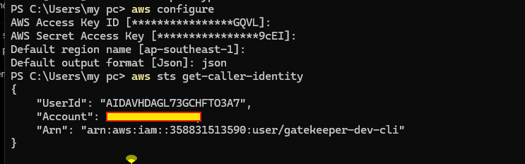

# AWS IAM Security Note

## Project

`the-gatekeeper-api`

## Goal

This project should not deploy AWS resources using the AWS root account.  
The CI/CD pipeline must use a separated AWS identity with limited permission.

## AWS Region

- Primary region: `ap-southeast-1`

## Identity Plan

### Root Account

- [x] MFA enabled
- [x] No root access key created
- [x] Root account is not used for deployment

### Local CLI Identity

- IAM identity name: `gatekeeper-dev-cli`
- Purpose: verify AWS CLI setup and inspect resources during development
- Verification command:

```bash
aws sts get-caller-identity
```

## Evidence


